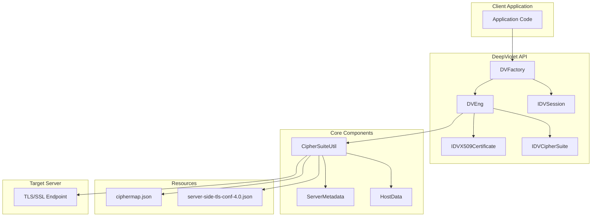
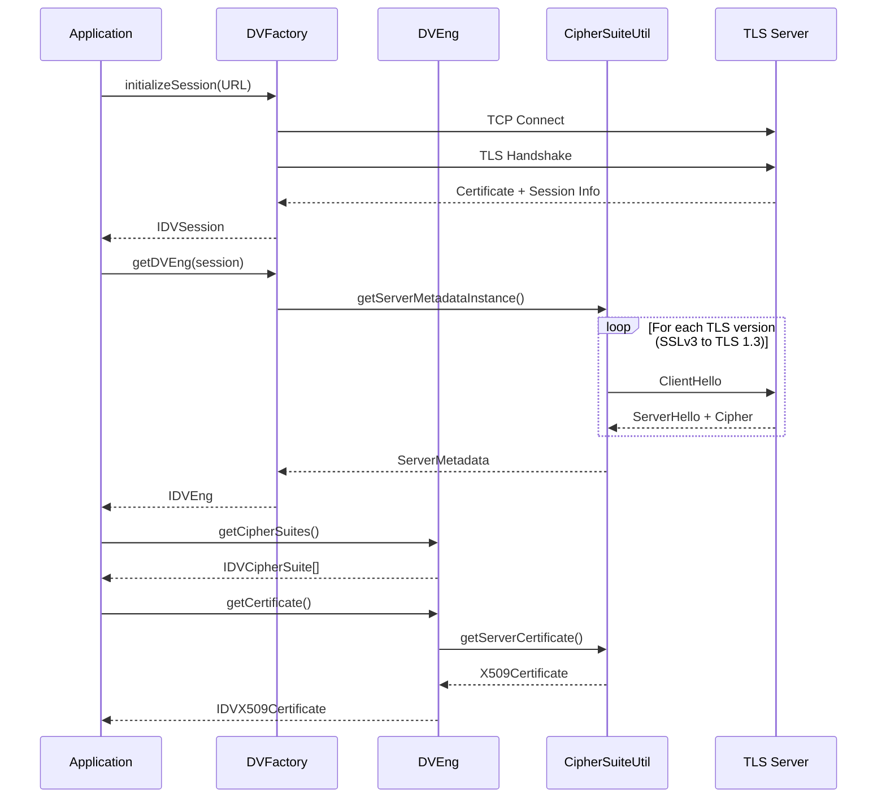

# DeepViolet

## Overview

DeepViolet is a TLS/SSL scanning API written in Java that provides programmatic introspection of TLS/SSL connections. The library enables developers to:

- Enumerate supported cipher suites on remote servers
- Analyze X.509 certificate chains and trust status
- Detect TLS/SSL vulnerabilities (BEAST, CRIME, FREAK)
- Support multiple cipher suite naming conventions (IANA, OpenSSL, GnuTLS, NSS)

While established tools like Qualys Labs, Mozilla Observatory, and OpenSSL already provide TLS/SSL scanning capabilities, few open-source Java APIs offer straightforward scanning solutions. DeepViolet fills that gap, providing a developer-friendly alternative that can be integrated directly into Java applications.

Reference implementations are available through the [DeepVioletTools](https://github.com/spoofzu/DeepVioletTools) project for both command-line and graphical usage.

## Features

### Information Gathering

- **TLS Connection Characteristics** -- Socket and protocol details including SO_KEEPALIVE, SO_RCVBUF, SO_LINGER, SO_TIMEOUT, SO_REUSEADDR, SO_SENDBUFF, CLIENT_AUTH_REQ, CLIENT_AUTH_WANT, TRAFFIC_CLASS, TCP_NODELAY, ENABLED_PROTOCOLS, DEFLATE_COMPRESSION
- **X.509 Certificate Metadata** -- Validity, SubjectDN, IssuerDN, Serial Number, Signature Algorithm, Signature Algorithm OID, Certificate Version, Certificate Fingerprint, Critical/Non-Critical OID sections
- **TLS Cipher Suite Naming** -- Returns readable cipher suite names in GnuTLS, NSS, OpenSSL, and IANA conventions
- **Web Server Cipher Suite Identification** -- Enumerates server cipher suites with strength assessment sourced from the Mozilla Observatory project (built into the project, not fetched at runtime)
- **Certificate Validity Assessment** -- Status on certificate validity and expiration date ranges
- **Trust Chain Verification** -- Confirms whether certificates chain back to trusted roots

### Server Analysis

- **Encryption Strength Evaluation** -- Measures minimal and achievable encryption strength in bits
- **Vulnerability Detection** -- Identifies BEAST, CRIME, and FREAK vulnerabilities

## Requirements

- Java 21 or higher
- Apache Maven 3.6.3 or higher

## Building from Source

### Compile and Test

```bash
mvn clean verify
```

### Compile Only

```bash
mvn compile
```

### Run Tests

```bash
# All tests
mvn test

# Single test class
mvn test -Dtest=CipherMapTest
```

### Generate Javadocs

```bash
mvn javadoc:javadoc
```

Generated documentation will be located at `docs/javadocs/`.

### Package JAR

```bash
mvn package
```

This creates two JAR files in the `target/` directory:
- `DeepViolet-*-SNAPSHOT.jar` -- DeepViolet binary only
- `DeepViolet-*-jar-with-dependencies.jar` -- Binary plus all project dependencies

## Maven Dependency

DeepViolet is deployed to Maven Central. Include the following in your `pom.xml`:

```xml
<dependency>
  <groupId>com.github.spoofzu</groupId>
  <artifactId>DeepViolet</artifactId>
  <version>5.1.16</version>
</dependency>
```

Or use the latest development snapshot:

```xml
<dependency>
  <groupId>com.github.spoofzu</groupId>
  <artifactId>DeepViolet</artifactId>
  <version>5.1.17-SNAPSHOT</version>
</dependency>
```

## Reference Tools

GUI and command-line tools that consume this API are available in the [DeepVioletTools](https://github.com/spoofzu/DeepVioletTools) project.

## Architecture

### Architecture Diagram



### Core Components

#### DVFactory

**Location:** `src/main/java/com/mps/deepviolet/api/DVFactory.java`

The factory class serves as the entry point for all DeepViolet API operations.

| Method | Description |
|--------|-------------|
| `initializeSession(URL)` | Creates an immutable session by connecting to a target host |
| `getDVEng(IDVSession)` | Returns an engine instance for TLS analysis |
| `getDVEng(IDVSession, CIPHER_NAME_CONVENTION)` | Returns engine with specific naming convention |
| `getDVEng(IDVSession, CIPHER_NAME_CONVENTION, DVBackgroundTask)` | Returns engine with progress callback |

#### IDVSession

**Location:** `src/main/java/com/mps/deepviolet/api/IDVSession.java`

The session interface represents an immutable connection context containing:

- Target URL and host information
- Socket configuration properties
- Vulnerability assessment results

**Key Enums:**

| Enum | Values |
|------|--------|
| `SESSION_PROPERTIES` | SO_KEEPALIVE, SO_RCVBUF, SO_LINGER, TCP_NODELAY, etc. |
| `VULNERABILITY_ASSESSMENTS` | BEAST_VULNERABLE, CRIME_VULNERABLE, FREAK_VULNERABLE, etc. |
| `CIPHER_NAME_CONVENTION` | IANA, OpenSSL, GnuTLS, NSS |

#### IDVEng

**Location:** `src/main/java/com/mps/deepviolet/api/IDVEng.java`

The engine interface provides TLS scanning functionality:

| Method | Description |
|--------|-------------|
| `getCipherSuites()` | Returns array of supported cipher suites |
| `getCertificate()` | Returns server's X.509 certificate |
| `writeCertificate(String)` | Exports PEM-encoded certificate to file |
| `getDeepVioletMajorVersion()` | Returns API major version |

#### IDVX509Certificate

**Location:** `src/main/java/com/mps/deepviolet/api/IDVX509Certificate.java`

Comprehensive X.509 certificate representation providing:

- Certificate metadata (subject DN, issuer DN, serial number)
- Validity status (valid, expired, not yet valid)
- Trust status (trusted, untrusted, unknown)
- Certificate chain access
- OID extraction (critical and non-critical)
- Fingerprint generation

#### CipherSuiteUtil

**Location:** `src/main/java/com/mps/deepviolet/api/CipherSuiteUtil.java`

Internal utility class handling:

- TLS handshake protocol implementation
- Cipher suite enumeration via iterative probing
- Certificate chain retrieval
- Vulnerability detection (BEAST, CRIME, FREAK)
- Cipher strength classification

### Data Flow



### Configuration Resources

#### ciphermap.json

**Location:** `src/main/resources/ciphermap.json`

Maps TLS cipher suite hex codes to human-readable names across multiple naming conventions.

```json
{
  "0x13,0x01": {
    "GnuTLS": "TLS_AES_128_GCM_SHA256",
    "NSS": "TLS_AES_128_GCM_SHA256",
    "IANA": "TLS_AES_128_GCM_SHA256",
    "OpenSSL": "TLS_AES_128_GCM_SHA256"
  }
}
```

#### server-side-tls-conf-4.0.json

**Location:** `src/main/resources/server-side-tls-conf-4.0.json`

Mozilla server-side TLS configuration containing cipher suite classifications:

- **modern**: Strong ciphers (TLS 1.3, AEAD)
- **intermediate**: Compatible ciphers
- **old**: Legacy support ciphers

### Protocol Support

| Protocol | Version Code | Status |
|----------|-------------|--------|
| SSLv2 | 0x0200 | Legacy (deprecated) |
| SSLv3 | 0x0300 | Legacy (deprecated) |
| TLS 1.0 | 0x0301 | Legacy |
| TLS 1.1 | 0x0302 | Legacy |
| TLS 1.2 | 0x0303 | Current |
| TLS 1.3 | 0x0304 | Current |

### Extension Points

#### Custom Background Tasks

Implement `DVBackgroundTask` to receive progress callbacks during scanning:

```java
DVBackgroundTask task = new DVBackgroundTask() {
    @Override
    public void setStatusBarMessage(String message) {
        // Handle progress updates
    }
};
IDVEng eng = DVFactory.getDVEng(session, IANA, task);
```

#### Cipher Naming Conventions

Select the cipher suite naming convention via the `CIPHER_NAME_CONVENTION` enum:

```java
IDVEng eng = DVFactory.getDVEng(session, CIPHER_NAME_CONVENTION.OpenSSL);
```

## API Usage Example

Explore the samples package at `src/main/java/com/mps/deepviolet/api/samples/` for working examples:

- `PrintServerCiphersuites.java` -- Enumerate server cipher suites
- `PrintRawX509Certificate.java` -- Retrieve and display certificates

## Contributing

You do not have to be a security expert or a programmer to contribute. Areas where help is welcome:

- **Coding** -- Unit tests, automated regression tests, new features
- **Testing** -- Finding bugs and verifying fixes
- **Localization** -- Translating text strings into other languages
- **Build Management** -- CI/CD, badges, build tooling

To report bugs or suggest features, [open an issue](https://github.com/spoofzu/DeepViolet/issues).

### Development Rules

1. Significant pull requests require accompanying documentation with minimum 3-day advance notice via issues before implementation
2. Pull requests purely for stylistic reformatting will be rejected; new code may follow the author's preferred style
3. Deliveries that introduce needless complexity will be rejected
4. Changes must maintain a cohesive set of modifications; existing functionality cannot be broken
5. Improvements should include corresponding unit tests where feasible
6. All third-party code and libraries must be licensed compatibly with Apache v2
7. Original authors must be acknowledged when incorporating their code
8. Check in code that is cleaner than you checked out

## Dependencies

| Dependency | Purpose |
|------------|---------|
| jackson-databind | JSON serialization/deserialization |
| json-path | JSON path queries for cipher mappings |
| bouncycastle | ASN.1 parsing and certificate handling |
| logback | Logging framework |

## Related Resources

- [Javadocs](./javadocs/index.html)
- [README](../README.md)
- [OWASP Project Page](https://www.owasp.org/index.php/OWASP_DeepViolet_TLS/SSL_Scanner)
- [Reference Tools (DeepVioletTools)](https://github.com/spoofzu/DeepVioletTools)

## Acknowledgements

This tool implements ideas, code, and takes inspiration from other projects and leaders like: Qualys SSL Labs and Ivan Ristic, OpenSSL, and Oracle's Java Security Team. Many thanks negotiating TLS/SSL handshakes and cipher suite handling adapted from code examples by Thomas Pornin.

*This project leverages the works of other open source community projects and is provided for educational purposes. Use at your own risk. See [LICENSE](../LICENSE) for further information.*
