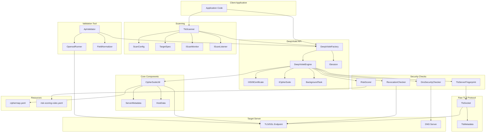
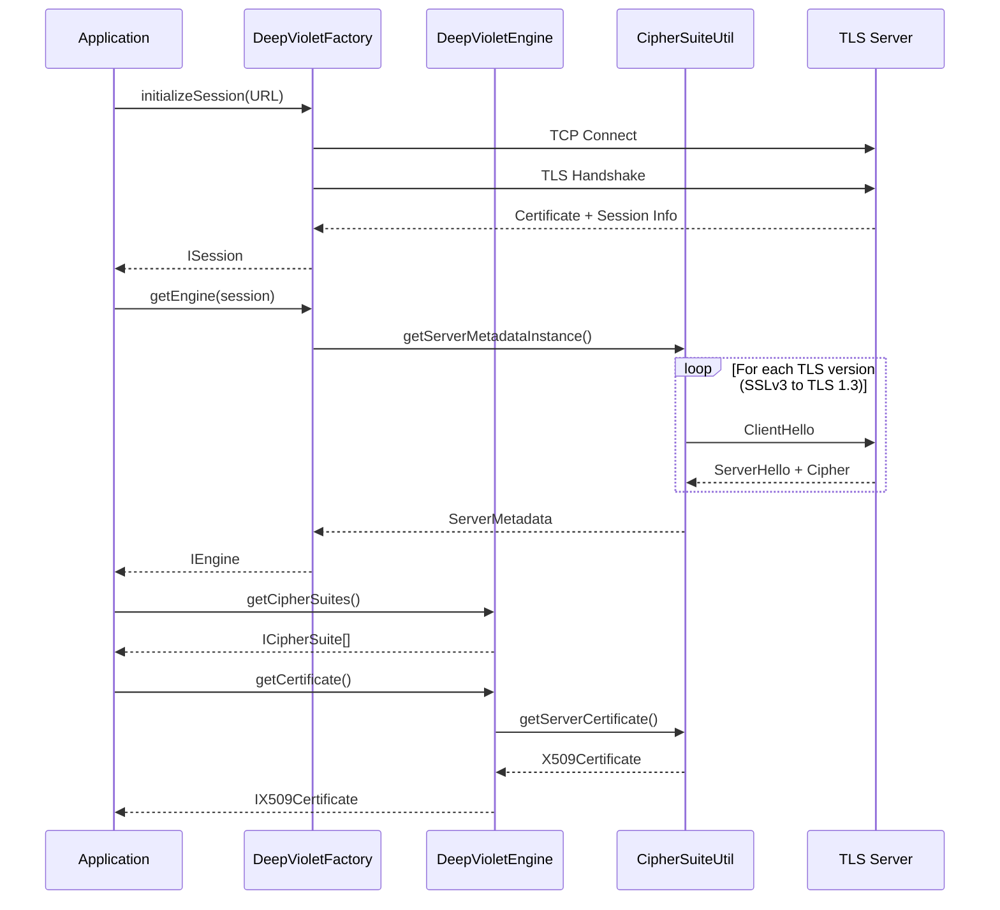
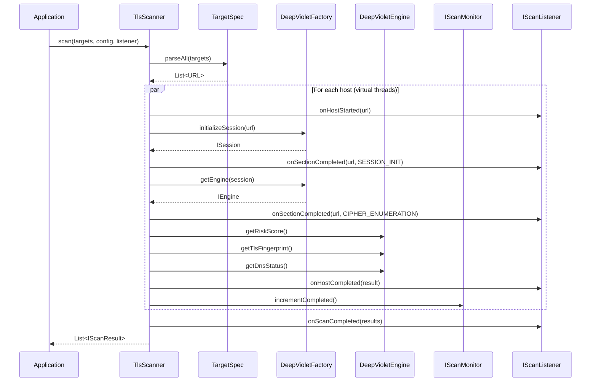

# DeepViolet

## Table of Contents

- [Overview](#overview)
- [Features](#features)
- [Requirements](#requirements)
- [Building from Source](#building-from-source)
- [Reference Tools](#reference-tools)
- [Architecture](#architecture)
  - [Architecture Diagram](#architecture-diagram)
  - [Core Components](#core-components)
  - [Data Flow](#data-flow)
  - [Configuration Resources](#configuration-resources)
  - [Protocol Support](#protocol-support)
  - [Extension Points](#extension-points)
- [Risk Scoring](#risk-scoring)
  - [Scoring Overview](#scoring-overview)
  - [Rule Identifiers](#rule-identifiers)
  - [Grade Mapping](#grade-mapping)
  - [Scoring Categories](#scoring-categories)
  - [Using Risk Scoring](#using-risk-scoring)
  - [Configuring the Scoring Rules](#configuring-the-scoring-rules)
  - [Expression Language Reference](#expression-language-reference)
  - [Rules File Reference](#rules-file-reference)
  - [Proposing Changes to Default Scoring](#proposing-changes-to-default-scoring)
- [API Reference](#api-reference)
- [API Usage Examples](#api-usage-examples)
- [API Validation Tool](#api-validation-tool)
- [Contributing](#contributing)
- [Dependencies](#dependencies)
- [Related Resources](#related-resources)
- [Documentation Notes](#documentation-notes)

## Documentation Notes

This document contains architecture and data flow diagrams written in [Mermaid](https://mermaid.js.org/) syntax. For the best viewing experience, use a Markdown renderer with Mermaid support.

### Viewing Mermaid Diagrams in IntelliJ IDEA

- IntelliJ IDEA 2023.1+ renders Mermaid diagrams natively in the Markdown preview.
- For older versions, install the **Mermaid** plugin from **Settings > Plugins > Marketplace** (search "Mermaid").
- Open any `.md` file and use the split editor (editor + preview) to see rendered diagrams alongside the source.

### Viewing Mermaid Diagrams in Eclipse

- Install the **Markdown Text Editor** plugin from the Eclipse Marketplace, which includes Mermaid rendering support.
- Alternatively, install the **Mylyn Docs** Markdown editor and pair it with a browser-based preview that supports Mermaid (e.g., the **Markdown Preview** view).
- If diagrams still appear as raw code blocks, copy the fenced `mermaid` block into the [Mermaid Live Editor](https://mermaid.live/) to view and export the diagram.

## Overview

DeepViolet is a TLS/SSL scanning API written in Java that provides programmatic introspection of TLS/SSL connections. The library enables developers to:

- Enumerate supported cipher suites on remote servers
- Analyze X.509 certificate chains and trust status
- Assess cipher suite encryption strength
- Support multiple cipher suite naming conventions (IANA, OpenSSL, GnuTLS, NSS)

While established tools like Qualys Labs, Mozilla Observatory, and OpenSSL already provide TLS/SSL scanning capabilities, few open-source Java APIs offer straightforward scanning solutions. DeepViolet fills that gap, providing a developer-friendly alternative that can be integrated directly into Java applications.

Reference implementations are available through the [DeepVioletTools](https://github.com/spoofzu/DeepVioletTools) project for both command-line and graphical usage.

## Features

### Information Gathering

- **TLS Connection Characteristics** -- Socket and protocol details including SO_KEEPALIVE, SO_RCVBUF, SO_LINGER, SO_TIMEOUT, SO_REUSEADDR, SO_SENDBUFF, CLIENT_AUTH_REQ, CLIENT_AUTH_WANT, TRAFFIC_CLASS, TCP_NODELAY, ENABLED_PROTOCOLS, DEFLATE_COMPRESSION
- **X.509 Certificate Metadata** -- Validity, SubjectDN, IssuerDN, Serial Number, Signature Algorithm, Signature Algorithm OID, Certificate Version, Certificate Fingerprint, Critical/Non-Critical OID sections
- **TLS Cipher Suite Naming** -- Returns readable cipher suite names in GnuTLS, NSS, OpenSSL, and IANA conventions
- **Web Server Cipher Suite Identification** -- Enumerates server cipher suites with strength assessment (built into the project, not fetched at runtime)
- **Certificate Validity Assessment** -- Status on certificate validity and expiration date ranges
- **Trust Chain Verification** -- Confirms whether certificates chain back to trusted roots

### Server Analysis

- **Encryption Strength Evaluation** -- Measures minimal and achievable encryption strength
- **TLS Risk Scoring** -- Quantitative risk assessment across 7 categories with configurable scoring policy, letter grades, and per-category breakdowns
- **TLS Fingerprinting** -- 62-character behavioral fingerprint based on 10 probe responses, characterizing cipher selection, extension ordering, and version negotiation patterns
- **DNS Security Checks** -- CAA (Certificate Authority Authorization) and DANE/TLSA record lookups
- **Certificate Revocation Checking** -- OCSP, CRL, OCSP stapling, Must-Staple, OneCRL, and Certificate Transparency (SCT) verification across embedded, TLS extension, and OCSP stapling delivery methods
- **TLS_FALLBACK_SCSV Detection** -- Tests for RFC 7507 downgrade protection

### Scanning

- **Multi-Host Parallel Scanning** -- Scan multiple targets concurrently using Java 21 virtual threads with configurable concurrency, per-host timeouts, and section-level delays
- **Flexible Target Parsing** -- Accepts hostnames, IPs, IPv6, host:port, CIDR notation (e.g., `10.0.0.0/24`), and IP ranges (e.g., `192.168.1.1-192.168.1.10`)
- **Section-Based Execution** -- Scans broken into 7 discrete phases (session init, cipher enumeration, certificate retrieval, risk scoring, TLS fingerprinting, DNS security, revocation check) that can be individually enabled or disabled
- **Event-Driven Monitoring** -- Callback listener (`IScanListener`) for host-started, section-started, section-completed, host-completed, and scan-completed events
- **Polling-Based Monitoring** -- Thread-safe monitor (`IScanMonitor`) exposing active/sleeping/idle thread counts and per-thread status snapshots for UI timer integration

### Scan Control

- **Cooperative Cancellation** -- Cancel in-progress scans via `BackgroundTask.cancel()`; scan methods check `isCancelled()` at natural boundaries and bail out gracefully
- **Cooperative Pause** -- Pause scans via `BackgroundTask.pause()`; scan methods check `isPaused()` at natural boundaries

## Requirements

- Java 21 or higher
- Apache Maven 3.6.3 or higher

## Building from Source

### Compile and Test

```bash
mvn clean verify
```

### Compile Only

```bash
mvn compile
```

### Run Tests

```bash
# All tests
mvn test

# Single test class
mvn test -Dtest=CipherMapTest
```

### Generate Javadocs

```bash
mvn javadoc:javadoc
```

Generated documentation will be located at `docs/javadocs/`.

### Package JAR

```bash
mvn package
```

This creates two JAR files in the `target/` directory:
- `DeepViolet-*-SNAPSHOT.jar` -- DeepViolet binary only
- `DeepViolet-*-jar-with-dependencies.jar` -- Binary plus all project dependencies

Projects that consume the DeepViolet API (such as [DeepVioletTools](https://github.com/spoofzu/DeepVioletTools)) use the locally compiled JAR.

### Build Validation Tool

```bash
mvn package -Pvalidate
```

This creates an additional JAR: `DeepViolet-*-validate.jar` — a standalone tool that compares DV API results against openssl for accuracy verification. See the [API Validation Tool](#api-validation-tool) section at the end of this document.

## Reference Tools

GUI and command-line tools that consume this API are available in the [DeepVioletTools](https://github.com/spoofzu/DeepVioletTools) project.

## Architecture

### Architecture Diagram



### Core Components

#### DeepVioletFactory

**Location:** `src/main/java/com/mps/deepviolet/api/DeepVioletFactory.java`

The factory class serves as the entry point for all DeepViolet API operations.

| Method | Description |
|--------|-------------|
| `initializeSession(URL)` | Creates an immutable session by connecting to a target host; captures OCSP stapled response and SCTs during handshake |
| `getEngine(ISession)` | Returns an engine instance for TLS analysis |
| `getEngine(ISession, CIPHER_NAME_CONVENTION)` | Returns engine with specific naming convention |
| `getEngine(ISession, CIPHER_NAME_CONVENTION, BackgroundTask)` | Returns engine with progress callback |
| `getEngine(ISession, CIPHER_NAME_CONVENTION, BackgroundTask, Set<Integer>)` | Returns engine with progress callback and protocol version filtering |
| `loadCipherMap(InputStream)` | Load a custom cipher map from a stream, fully replacing the built-in map |
| `resetCipherMap()` | Reset the cipher map to the built-in default |

#### ISession

**Location:** `src/main/java/com/mps/deepviolet/api/ISession.java`

The session interface represents an immutable connection context containing:

- Target URL and host information
- Socket configuration properties
- Negotiated protocol and cipher suite
- OCSP stapled response (captured during TLS handshake)
- HTTP response headers

**Key Methods:**

| Method | Description |
|--------|-------------|
| `getHostInterfaces()` | All host interfaces for the target |
| `getSessionPropertyValue(SESSION_PROPERTIES)` | Return a session property value |
| `getURL()` | URL used to initialize the session |
| `getHttpResponseHeaders()` | HTTP(S) response headers captured during initialization |
| `getStapledOcspResponse()` | OCSP stapled response bytes from TLS handshake, or null |

**Key Enums:**

| Enum | Values |
|------|--------|
| `SESSION_PROPERTIES` | SO_KEEPALIVE, SO_RCVBUF, SO_LINGER, TCP_NODELAY, DEFLATE_COMPRESSION, NEGOTIATED_PROTOCOL, NEGOTIATED_CIPHER_SUITE, etc. |
| `CIPHER_NAME_CONVENTION` | IANA, OpenSSL, GnuTLS, NSS |

#### IEngine

**Location:** `src/main/java/com/mps/deepviolet/api/IEngine.java`

The engine interface provides TLS scanning functionality:

| Method | Description |
|--------|-------------|
| `getCipherSuites()` | Returns array of supported cipher suites |
| `getCertificate()` | Returns server's X.509 certificate |
| `writeCertificate(String)` | Exports PEM-encoded certificate to file |
| `getRiskScore()` | Computes risk score using default policy |
| `getRiskScore(String)` | Computes risk score using custom policy file |
| `getRiskScore(InputStream)` | Computes risk score merging user rules with defaults |
| `getTlsFingerprint()` | Computes 62-character TLS server fingerprint |
| `getSCTs()` | Returns Signed Certificate Timestamps from all sources |
| `getTlsMetadata()` | Returns detailed TLS metadata from raw protocol parsing |
| `getFallbackScsvSupported()` | Tests for TLS_FALLBACK_SCSV support (RFC 7507) |
| `getDnsStatus()` | Returns DNS security status (CAA, DANE/TLSA records) |
| `getDeepVioletMajorVersion()` | Returns API major version |

#### IX509Certificate

**Location:** `src/main/java/com/mps/deepviolet/api/IX509Certificate.java`

Comprehensive X.509 certificate representation providing:

- Certificate metadata (subject DN, issuer DN, serial number)
- Validity status (valid, expired, not yet valid)
- Trust status (trusted, untrusted, unknown)
- Certificate chain access
- OID extraction (critical and non-critical)
- Fingerprint generation

#### CipherSuiteUtil

**Location:** `src/main/java/com/mps/deepviolet/api/CipherSuiteUtil.java`

Internal utility class handling:

- TLS handshake protocol implementation
- Cipher suite enumeration via iterative probing
- Certificate chain retrieval
- Cipher strength classification

#### TlsScanner

**Location:** `src/main/java/com/mps/deepviolet/api/TlsScanner.java`

TLS scanner that scans multiple hosts in parallel using Java 21 virtual threads with a semaphore to cap concurrency.

| Method | Description |
|--------|-------------|
| `scan(Collection<String>)` | Scan targets with default configuration |
| `scan(Collection<String>, ScanConfig)` | Scan targets with custom configuration |
| `scan(Collection<String>, ScanConfig, IScanListener)` | Scan with configuration and event listener |
| `scan(List<URL>, ScanConfig, IScanListener)` | Scan pre-parsed URLs |
| `scanAsync(Collection<String>, ScanConfig, IScanListener)` | Async variant returning `CompletableFuture` |
| `getMonitor()` | Get the global `IScanMonitor` for polling progress |

Each host scan executes up to 7 sections (see `ScanSection`):

| Section | Description |
|---------|-------------|
| `SESSION_INIT` | Session initialization |
| `CIPHER_ENUMERATION` | Cipher suite enumeration |
| `CERTIFICATE_RETRIEVAL` | Certificate retrieval |
| `RISK_SCORING` | Risk scoring |
| `TLS_FINGERPRINT` | TLS fingerprinting |
| `DNS_SECURITY` | DNS security check |
| `REVOCATION_CHECK` | Revocation check |

#### ScanConfig

**Location:** `src/main/java/com/mps/deepviolet/api/ScanConfig.java`

Configuration for scanning, created via `ScanConfig.builder()`:

| Setting | Default | Description |
|---------|---------|-------------|
| `threadCount` | 10 | Number of concurrent virtual threads |
| `sectionDelayMs` | 200 | Milliseconds to sleep between sections on the same host |
| `perHostTimeoutMs` | 60000 | Max time for a single host scan |
| `cipherNameConvention` | IANA | Cipher suite naming convention |
| `enabledProtocols` | null (all) | TLS protocol versions to probe |
| `enabledSections` | all | Which scan sections to execute |

#### TargetSpec

**Location:** `src/main/java/com/mps/deepviolet/api/TargetSpec.java`

Parses flexible target specification strings into URLs:

| Format | Example | Result |
|--------|---------|--------|
| Hostname | `github.com` | `https://github.com:443` |
| Hostname + port | `github.com:8443` | `https://github.com:8443` |
| Full URL | `https://example.com/` | As-is |
| IPv4 | `192.168.1.1` | `https://192.168.1.1:443` |
| IPv6 | `[::1]:8443` | `https://[::1]:8443` |
| IP range | `192.168.1.1-192.168.1.10` | 10 targets (up to 65,534 hosts) |
| CIDR | `10.0.0.0/24` | 254 targets (.1-.254) |
| CIDR + port | `10.0.0.0/24:636` | 254 targets on port 636 |

| Method | Description |
|--------|-------------|
| `parse(String)` | Parse a single spec into URLs (default port 443) |
| `parse(String, int)` | Parse with custom default port |
| `parseAll(Collection<String>)` | Parse multiple specs, deduplicated |

#### BackgroundTask

**Location:** `src/main/java/com/mps/deepviolet/api/BackgroundTask.java`

Background task with cooperative cancel and pause support:

| Method | Description |
|--------|-------------|
| `cancel()` | Request cooperative cancellation |
| `isCancelled()` | Check if cancelled |
| `pause()` | Request cooperative pause |
| `isPaused()` | Check if paused |
| `setStatusBarMessage(String)` | Set status bar text for UI |
| `isWorking()` | Check if the background thread is still running |

Scan methods check `isCancelled()` and `isPaused()` at natural boundaries and bail out gracefully.

#### IScanListener

**Location:** `src/main/java/com/mps/deepviolet/api/IScanListener.java`

Callback interface for scan events. All methods have default no-op implementations:

| Method | Description |
|--------|-------------|
| `onHostStarted(URL, int, int)` | A host scan is starting |
| `onSectionStarted(URL, ScanSection)` | A section is starting on a host |
| `onSectionCompleted(URL, ScanSection)` | A section completed on a host |
| `onHostCompleted(IScanResult, int, int)` | A host scan completed (success or failure) |
| `onScanCompleted(List<IScanResult>)` | All hosts scanned |
| `onHostStatus(URL, String)` | Status text from the scanning engine |

#### IScanMonitor

**Location:** `src/main/java/com/mps/deepviolet/api/IScanMonitor.java`

Pollable interface for monitoring scan progress, suitable for UI timer integration:

| Method | Description |
|--------|-------------|
| `getActiveThreadCount()` | Threads actively executing a section |
| `getSleepingThreadCount()` | Threads in per-host section delay |
| `getIdleThreadCount()` | Threads waiting for work |
| `getCompletedHostCount()` | Hosts completed so far |
| `getTotalHostCount()` | Total hosts in the scan |
| `isRunning()` | Whether the scan is still running |
| `getThreadStatuses()` | Snapshot of per-thread status |

#### DnsSecurityChecker

**Location:** `src/main/java/com/mps/deepviolet/api/DnsSecurityChecker.java`

Checks for DNS security records using JNDI DNS lookups:

- **CAA Records** -- Certificate Authority Authorization, restricting which CAs can issue certificates
- **TLSA Records** -- DANE (DNS-Based Authentication of Named Entities), binding X.509 certificates to DNS via DNSSEC

#### RevocationChecker

**Location:** `src/main/java/com/mps/deepviolet/api/RevocationChecker.java`

Performs comprehensive certificate revocation and transparency checks:

- **OCSP** -- Online Certificate Status Protocol queries
- **CRL** -- Certificate Revocation List download and lookup
- **OCSP Stapling** -- Parses stapled response from TLS handshake
- **Must-Staple** -- Detects TLS Feature extension (OID 1.3.6.1.4.1.5.5.7.1.24)
- **OneCRL** -- Mozilla's centralized revocation service
- **Certificate Transparency** -- Signed Certificate Timestamps (SCTs) from embedded, TLS extension, and OCSP stapling sources

### Data Flow



#### Scanning Data Flow



### Configuration Resources

#### ciphermap.yaml

**Location:** `src/main/resources/ciphermap.yaml`

Unified cipher suite map containing hex IDs, name mappings (IANA, OpenSSL, GnuTLS, NSS), strength evaluations, and TLS version annotations.

```yaml
metadata:
  version: "1.0"
  description: "DeepViolet unified cipher suite map"
  last_updated: "2026-02-11"

cipher_suites:
  # TLS 1.3 ciphers
  - id: "0x13,0x01"
    names:
      IANA: "TLS_AES_128_GCM_SHA256"
      OpenSSL: "TLS_AES_128_GCM_SHA256"
      GnuTLS: "TLS_AES_128_GCM_SHA256"
      NSS: "TLS_AES_128_GCM_SHA256"
    strength: STRONG
    tls_versions: ["TLSv1.3"]
```

Strength values: `STRONG`, `MEDIUM`, `WEAK`, `CLEAR` (no encryption), `UNASSIGNED`.

#### Modifying a Cipher Suite's Strength

If your organization's security policy requires different strength classifications, edit the `strength` field for the relevant cipher suites in `ciphermap.yaml` directly. The file is designed to be user-editable. No code changes are required -- `CipherSuiteUtil` reads strength values from the YAML at runtime.

For example, to reclassify `TLS_DHE_RSA_WITH_AES_128_GCM_SHA256` from MEDIUM to STRONG:

```yaml
  - id: "0x00,0x9E"
    names:
      IANA: "TLS_DHE_RSA_WITH_AES_128_GCM_SHA256"
      OpenSSL: "DHE-RSA-AES128-GCM-SHA256"
      GnuTLS: "TLS_DHE_RSA_AES_128_GCM_SHA256"
      NSS: "TLS_DHE_RSA_WITH_AES_128_GCM_SHA256"
    strength: STRONG          # changed from MEDIUM
    tls_versions: ["TLSv1.2"]
```

#### Adding a New Cipher Suite

Append a new entry to the `cipher_suites` list. Each entry requires an `id` (hex pair), `names` (with at least the IANA name), `strength`, and `tls_versions`:

```yaml
  # Example: adding a hypothetical new cipher
  - id: "0xCA,0xFE"
    names:
      IANA: "TLS_EXAMPLE_WITH_AES_256_GCM_SHA384"
      OpenSSL: "EXAMPLE-AES256-GCM-SHA384"
      GnuTLS: ""
      NSS: ""
    strength: STRONG
    tls_versions: ["TLSv1.3"]
```

If a naming convention has no known name for a cipher, use an empty string (`""`).

#### Proposing Changes to Default Strengths

If you believe a default classification is incorrect, [open an issue](https://github.com/spoofzu/DeepViolet/issues) explaining:

1. Which cipher suite(s) should change and to what strength
2. Your technical rationale with supporting references (RFCs, CVEs, industry guidance)

If the proposal is approved, submit a pull request to `ciphermap.yaml` and include a reference to the approved issue. Pull requests that modify `ciphermap.yaml` strength values without a corresponding approved issue will be denied.

### Protocol Support

| Protocol | Version Code | Status |
|----------|-------------|--------|
| SSLv2 | 0x0200 | Legacy (deprecated) |
| SSLv3 | 0x0300 | Legacy (deprecated) |
| TLS 1.0 | 0x0301 | Legacy |
| TLS 1.1 | 0x0302 | Legacy |
| TLS 1.2 | 0x0303 | Current |
| TLS 1.3 | 0x0304 | Current |

### Extension Points

#### Custom Background Tasks

Implement `BackgroundTask` to receive progress callbacks during scanning:

```java
BackgroundTask task = new BackgroundTask() {
    @Override
    public void setStatusBarMessage(String message) {
        // Handle progress updates
    }
};
IEngine eng = DeepVioletFactory.getEngine(session, IANA, task);
```

#### Cancelling and Pausing Scans

Use the cooperative cancel and pause methods on `BackgroundTask`:

```java
BackgroundTask task = new BackgroundTask() { ... };
IEngine eng = DeepVioletFactory.getEngine(session, IANA, task);

// Cancel the scan from another thread
task.cancel();

// Or pause it
task.pause();
```

Scan methods check `isCancelled()` and `isPaused()` at natural boundaries and stop gracefully.

#### Scanning

Scan multiple hosts in parallel with configurable concurrency and event monitoring:

```java
ScanConfig config = ScanConfig.builder()
    .threadCount(5)
    .perHostTimeoutMs(30000)
    .sectionDelayMs(100)
    .build();

List<IScanResult> results = TlsScanner.scan(
    List.of("github.com", "google.com", "10.0.0.0/24:636"),
    config,
    new IScanListener() {
        @Override
        public void onHostCompleted(IScanResult result, int done, int total) {
            System.out.printf("[%d/%d] %s%n", done, total, result.getURL());
        }
    }
);
```

Poll progress during a scan using the monitor:

```java
IScanMonitor monitor = TlsScanner.getMonitor();
while (monitor.isRunning()) {
    System.out.printf("Progress: %d/%d  Active: %d  Sleeping: %d%n",
        monitor.getCompletedHostCount(), monitor.getTotalHostCount(),
        monitor.getActiveThreadCount(), monitor.getSleepingThreadCount());
    Thread.sleep(1000);
}
```

#### Cipher Naming Conventions

Select the cipher suite naming convention via the `CIPHER_NAME_CONVENTION` enum:

```java
IEngine eng = DeepVioletFactory.getEngine(session, CIPHER_NAME_CONVENTION.OpenSSL);
```

## Risk Scoring

### Scoring Overview

DeepViolet provides a quantitative TLS risk scoring system that evaluates a server's TLS configuration using an average-based model with severity floors. The score is mapped to a letter grade (A+ through F) and a risk level (LOW, MEDIUM, HIGH, CRITICAL).

Each rule has a normalized score (0.0-1.0) indicating its severity. When rules match, their scores are averaged, converted to a 0-100 scale, and capped by a severity floor derived from the highest-scoring matched rule. A perfect server configuration with no findings scores 100/100 (grade A+).

**Algorithm:**
1. Collect all matched rules and their scores (0.0-1.0)
2. Average the scores: `avg = sum(scores) / count(scores)`
3. Find the highest score among matched rules and look up its severity floor
4. Convert to 0-100: `numeric_score = 100 * (1.0 - avg)`
5. Apply floor: `final_score = min(numeric_score, floor)`
6. Map `final_score` to a letter grade via `grade_mapping`

If no rules match, the score is 100 (perfect). Categories compute their own sub-averages for display (same formula, steps 1-4, no floor). Adding new rules to a category never requires rebalancing existing score values.

All scoring rules -- including their conditions, score values, and grade boundaries -- are defined in a single YAML file (`risk-scoring-rules.yaml`). Severity is derived at runtime from the `severity_mapping` section. No code changes are required to add, modify, disable, or remove rules.

**Rules file:** `src/main/resources/risk-scoring-rules.yaml`
**Scoring engine:** `src/main/java/com/mps/deepviolet/api/scoring/`

### Rule Identifiers

Every rule has a stable identifier in the format `SYS-NNNNNNN` (system rules shipped in the JAR) or `USR-NNNNNNN` (user-defined rules). For example, `SYS-0000100` is the SSLv2 detection rule. These IDs are permanent and must never be reassigned to a different rule. IDs increment by 100 to allow inserting new rules between existing ones. When adding new rules, use the next available ID noted in the `metadata` section of `risk-scoring-rules.yaml` or an unused ID between existing rules within the same category. Rule IDs appear in deduction output via `IDeduction.getRuleId()`, making it easy to reference specific findings unambiguously.

Each rule has a `score` field (0.0-1.0) that indicates the normalized severity of the finding. Severity labels (CRITICAL, HIGH, MEDIUM, LOW, INFO) are derived at runtime from the `severity_mapping` section rather than being hardcoded per rule.

### Severity Mapping

The `severity_mapping` section maps rule score ranges to severity labels and overall score floors:

| Severity | Min Score | Floor | Description |
|----------|-----------|-------|-------------|
| CRITICAL | 0.8       | 65    | Scores >= 0.8 cap the total at 65 |
| HIGH     | 0.5       | 75    | Scores >= 0.5 cap the total at 75 |
| MEDIUM   | 0.2       | 85    | Scores >= 0.2 cap the total at 85 |
| LOW      | 0.01      | 100   | No cap applied |
| INFO     | 0.0       | 100   | Informational, no cap applied |

The floor ensures that a single critical finding (e.g., an expired certificate with score 1.0) prevents the overall score from exceeding 65, regardless of how many other rules pass.

### Grade Mapping

| Grade | Minimum Score | Risk Level |
|-------|--------------|------------|
| A+    | 95           | LOW        |
| A     | 90           | LOW        |
| B     | 80           | MEDIUM     |
| C     | 70           | HIGH       |
| D     | 60           | CRITICAL   |
| F     | 0            | CRITICAL   |

### Scoring Categories

The system evaluates 7 categories. Each category computes its own sub-average independently:

| Category | Description |
|----------|-------------|
| Protocols & Connections | TLS/SSL protocol version support |
| Cipher Suites | Cipher strength and selection |
| Certificate & Chain | Certificate validity, trust, key strength |
| Revocation & Transparency | OCSP, CRL, Certificate Transparency |
| Security Headers | HSTS, CSP, X-Frame-Options |
| DNS Security | CAA records, DANE/TLSA |
| Other | Compression, SAN exposure, fingerprinting |

#### Protocols & Connections

| ID | Rule | Score | Motivation | Condition |
|----|------|-------|------------|-----------|
| SYS-0000100 | SSLv2 supported | 1.0 | Prohibited by RFC 6176. Fundamental flaws including unprotected handshakes enabling MITM cipher downgrade. | `protocols contains "SSLv2"` |
| SYS-0000200 | SSLv3 supported | 0.9 | Deprecated by RFC 7568 ("MUST NOT be used"). POODLE attack (CVE-2014-3566) enables plaintext recovery via non-deterministic CBC padding; RC4 (its only stream cipher) has fatal biases. | `protocols contains "SSLv3"` |
| SYS-0000300 | TLS 1.0 supported | 0.6 | Deprecated by RFC 8996. No AEAD cipher support, SHA-1 handshake integrity. NIST SP 800-52r2 Section 3.1 prohibits for federal systems; PCI DSS required migration by June 2018. | `protocols contains "TLSv1.0"` |
| SYS-0000400 | TLS 1.1 supported | 0.5 | Deprecated by RFC 8996 alongside TLS 1.0 for the same reasons. NIST SP 800-52r2 Section 3.1 likewise prohibits. | `protocols contains "TLSv1.1"` |
| SYS-0000500 | TLS 1.3 not supported | 0.5 | RFC 8446 mandates AEAD-only ciphers, removes static RSA (guaranteeing PFS), encrypts handshake messages, eliminates compression/renegotiation/SHA-1/CBC. NIST SP 800-52r2 requires TLS 1.3 support by January 2024. | `protocols not contains "TLSv1.3"` |
| SYS-0000600 | TLS 1.2 negotiated instead of 1.3 | 0.2 | RFC 9325 Section 3.1 recommends TLS 1.3 as preferred version. TLS 1.3 eliminates entire attack classes present in 1.2 (CBC padding oracles, static RSA, renegotiation). Negotiating 1.2 when 1.3 is available may indicate misconfiguration. | `protocols contains "TLSv1.3" and contains(session.negotiated_protocol, "TLSv1.2")` |
| SYS-0000700 | Secure renegotiation not supported on TLS 1.2 | 0.7 | RFC 5746 fixes CVE-2009-3555 (MITM injection via unbound renegotiation). RFC 9325 Section 3.5 mandates renegotiation_info. Not applicable to TLS 1.3 which removed renegotiation entirely. | `session.tls_metadata_available == true and session.renegotiation_info_present == false and not contains(session.negotiated_protocol, "TLSv1.3")` |
| SYS-0000800 | TLS 1.3 early data (0-RTT) accepted | 0.4 | RFC 8446 Section 8.1 warns 0-RTT has "no guarantee of non-replay between connections." RFC 8470 details HTTP replay risks. | `session.tls_metadata_available == true and session.early_data_accepted == true` |
| SYS-0000900 | ALPN not negotiated | 0.1 | RFC 7301 defines ALPN; RFC 9113 Section 3.2 requires it for HTTP/2. Absence prevents HTTP/2 negotiation and indicates a less capable TLS stack. | `session.tls_metadata_available == true and session.alpn_negotiated == null` |
| SYS-0001000 | Server does not support TLS_FALLBACK_SCSV | 0.3 | RFC 7507 defines TLS_FALLBACK_SCSV to prevent protocol downgrade attacks, most notably POODLE (CVE-2014-3566). Servers reject downgraded connections with `inappropriate_fallback` alert. | `session.fallback_scsv_supported == false` |

#### Cipher Suites

| ID | Rule | Score | Motivation | Condition |
|----|------|-------|------------|-----------|
| SYS-0010100 | NULL/CLEAR ciphers offered | 0.9 | RFC 9325 Section 4.1: "MUST NOT negotiate cipher suites with NULL encryption." Zero confidentiality despite TLS wrapper. NIST SP 800-52r2 Section 3.3.1 likewise excludes NULL encryption. | `count(ciphers, strength == "CLEAR") > 0` |
| SYS-0010200 | 6+ WEAK ciphers offered | 0.7 | RFC 9325 Section 4.1 prohibits ciphers below 112 bits. A large weak cipher set increases downgrade attack surface. NIST SP 800-131A Rev. 2 disallows below 112 bits after 2023. | `count(ciphers, strength == "WEAK") >= 6` |
| SYS-0010300 | 1-5 WEAK ciphers offered | 0.3 | Same basis as SYS-0010200 at reduced severity. Even a few weak ciphers create downgrade attack surface per RFC 9325 Section 4.1 and NIST SP 800-52r2. | `count(ciphers, strength == "WEAK") > 0 and count(ciphers, strength == "WEAK") < 6` |
| SYS-0010400 | No STRONG ciphers available | 0.6 | NIST SP 800-52r2 Section 3.3.1 requires AES-128/256 with GCM or CCM. RFC 9325 Section 4.2 recommends AEAD with 128+ bit keys as baseline. | `count(ciphers) > 0 and count(ciphers, strength == "STRONG") == 0` |
| SYS-0010500 | Negotiated cipher is WEAK | 0.6 | RFC 9325 Section 4.1 MUST NOT language applies to the negotiated result. NIST SP 800-131A Rev. 2 classifies below 112 bits as "disallowed." | `session.negotiated_cipher_strength == "WEAK"` |
| SYS-0010600 | Negotiated cipher is MEDIUM | 0.2 | NIST SP 800-131A Rev. 2 deprecates medium-strength ciphers (e.g., 3DES). SWEET32 birthday attack (CVE-2016-2183) exploits 64-bit block ciphers at ~32 GB of data. | `session.negotiated_cipher_strength == "MEDIUM"` |
| SYS-0010700 | RC4 ciphers offered | 0.8 | RFC 7465 categorically bans RC4: "MUST NOT include" / "MUST NOT select." Multiple statistical biases enable plaintext recovery. NIST SP 800-52r2 also excludes RC4. | `count(ciphers, name contains "RC4") > 0` |
| SYS-0010800 | DES ciphers offered | 0.7 | DES uses 56-bit key, far below NIST SP 800-131A Rev. 2 minimum of 112 bits. 3DES vulnerable to SWEET32 (CVE-2016-2183) via 64-bit block size. | `count(ciphers, name contains "_DES_") > 0` |
| SYS-0010900 | EXPORT ciphers offered | 0.9 | RFC 9325 Section 4.1 prohibits export-level encryption (40/56 bits). Central to FREAK (CVE-2015-0204) and Logjam (CVE-2015-4000) downgrade attacks. | `count(ciphers, name contains "EXPORT") > 0` |
| SYS-0011000 | Only CBC mode ciphers (no AEAD) | 0.3 | RFC 9325 Section 4.2: CBC "SHOULD NOT be used" without encrypt_then_mac (RFC 7366), due to padding oracle history (Lucky Thirteen, POODLE, GOLDENDOODLE). AEAD modes are immune by design. NIST SP 800-52r2 recommends GCM. | `count(ciphers) > 0 and count(ciphers, name contains "GCM") == 0 and count(ciphers, name contains "CCM") == 0 and count(ciphers, name contains "CHACHA20") == 0` |
| SYS-0011100 | No forward secrecy ciphers (TLS 1.2) | 0.6 | RFC 9325 Section 4.1: "MUST support and prefer cipher suites offering forward secrecy." Without ephemeral key exchange, server key compromise decrypts all past sessions. NIST SP 800-52r2 Section 3.3.1 requires ephemeral key exchange. | `count(ciphers, protocol == "TLSv1.2") > 0 and count(ciphers, name contains "ECDHE") == 0 and count(ciphers, name contains "DHE") == 0` |
| SYS-0011200 | Negotiated cipher lacks PFS | 0.5 | Same basis as SYS-0011100. RFC 9325 Section 4.1 requires forward secrecy; static RSA key transport explicitly lacks it. Applied to the active session's negotiated cipher. | `session.negotiated_cipher_suite != null and not contains(session.negotiated_protocol, "TLSv1.3") and not contains(session.negotiated_cipher_suite, "ECDHE") and not contains(session.negotiated_cipher_suite, "DHE")` |
| SYS-0011300 | Negotiated cipher is not AEAD | 0.3 | RFC 9325 Section 4.2 discourages CBC in favor of AEAD. Active session susceptible to CBC padding oracle attacks (Lucky Thirteen, POODLE CVE-2014-3566, variants). | `session.negotiated_cipher_suite != null and not contains(session.negotiated_protocol, "TLSv1.3") and not contains(session.negotiated_cipher_suite, "GCM") and not contains(session.negotiated_cipher_suite, "CCM") and not contains(session.negotiated_cipher_suite, "CHACHA20")` |
| SYS-0011400 | DH prime < 2048 bits | 0.6 | NIST SP 800-56A Rev. 3 Section 5.5.1 requires 2048-bit DH minimum (112-bit security). RFC 9325 Section 4.1 mandates at least 112-bit security for all key exchange. | `session.tls_metadata_available == true and session.kex_type == "DHE" and session.dh_param_size > 0 and session.dh_param_size < 2048` |
| SYS-0011500 | DH prime < 1024 bits (Logjam) | 0.9 | Logjam attack (CVE-2015-4000, weakdh.org) showed 512-bit DH primes trivially factorable and 1024-bit primes plausibly precomputable by nation-state adversaries. | `session.tls_metadata_available == true and session.kex_type == "DHE" and session.dh_param_size > 0 and session.dh_param_size < 1024` |
| SYS-0011600 | Server honors client cipher preference | 0.3 | RFC 9325 Section 4.2.1 recommends server-enforced cipher preference. NIST SP 800-52r2 Section 3.3.1 recommends server-side ordering. Without it, a malicious or misconfigured client can force the weakest mutually-supported cipher. Best practice, not a protocol mandate — RFC 5246 leaves server selection discretionary. | `session.honors_client_cipher_preference == true` |

#### Certificate & Chain

| ID | Rule | Score | Motivation | Condition |
|----|------|-------|------------|-----------|
| SYS-0020100 | Certificate expired | 1.0 | RFC 5280 Section 4.1.2.5 — certificate MUST be rejected after `notAfter`. CA/B Forum BR Section 4.9.1.1. | `cert.validity_state == "EXPIRED"` |
| SYS-0020200 | Certificate not yet valid | 1.0 | RFC 5280 Section 6.1.3(a)(2) — current time must fall within validity period. NIST SP 800-52r2 Section 3.5. | `cert.validity_state == "NOT_YET_VALID"` |
| SYS-0020300 | Certificate not trusted | 0.9 | RFC 5280 Section 6 — chain must terminate at a trusted root. CA/B Forum BR Section 7.1. | `cert.trust_state == "UNTRUSTED"` |
| SYS-0020400 | Certificate trust unknown | 0.5 | RFC 5280 Section 6.1.1(d) — trust anchors required for path validation. Indeterminate trust status when chain cannot be validated. | `cert.trust_state == "UNKNOWN"` |
| SYS-0020500 | Self-signed certificate | 0.7 | RFC 5280 Section 6.1 — path validation fails when self-signed cert not in trust store. CA/B Forum BR Section 7.1.2 requires CA-issued end-entity certificates. | `cert.self_signed == true and cert.java_root == false` |
| SYS-0020600 | RSA key < 2048 bits | 0.6 | NIST SP 800-57 Part 1 Rev. 5, Table 2 — RSA < 2048 provides < 112 bits of security, disallowed since 2014. CA/B Forum BR Section 6.1.5 mandates 2048-bit minimum. | `cert.key_algorithm == "RSA" and cert.key_size > 0 and cert.key_size < 2048` |
| SYS-0020700 | EC key < 256 bits | 0.6 | NIST SP 800-57 Part 1 Rev. 5 — 256-bit ECC minimum for 128-bit security. CA/B Forum BR Section 6.1.5 requires P-256, P-384, or P-521. | `(cert.key_algorithm == "EC" or cert.key_algorithm == "ECDSA") and cert.key_size > 0 and cert.key_size < 256` |
| SYS-0020800 | Weak signature algorithm (SHA-1 or MD5) | 0.3 | NIST SP 800-131A Rev. 2 disallowed SHA-1 for signatures after 2013. SHAttered attack (2017) demonstrated full SHA-1 collision. CA/B Forum Ballot 152 prohibited SHA-1 certificates from January 2016. | `contains(upper(cert.signing_algorithm), "SHA1") or contains(upper(cert.signing_algorithm), "SHA-1") or contains(upper(cert.signing_algorithm), "MD5")` |
| SYS-0020900 | Expires in < 30 days | 0.8 | CA/B Forum BR Section 4.9.1.1 and ACME (RFC 8555) renewal best practices. Let's Encrypt recommends renewal at 30 days remaining. NIST SP 800-52r2 Section 3.5 advises proactive renewal. | `cert.days_until_expiration >= 0 and cert.days_until_expiration < 30` |
| SYS-0021000 | Expires in < 90 days | 0.4 | Standard warning threshold aligned with Let's Encrypt 90-day certificate lifetime. NIST SP 800-52r2 Section 3.5 recommends proactive renewal monitoring. | `cert.days_until_expiration >= 30 and cert.days_until_expiration < 90` |
| SYS-0021100 | No intermediates in chain | 0.2 | RFC 8446 Section 4.4.2 — server SHOULD send complete chain (excluding root). Missing intermediates cause path validation failures per RFC 5280 Section 6.1. | `cert.chain_length == 1` |
| SYS-0021200 | Wildcard certificate in use | 0.1 | CA/B Forum BR Section 3.2.2.6. NIST SP 800-52r2 Section 3.5 notes wildcard certificates increase blast radius — one key compromise affects all subdomains. | `cert.has_wildcard_san == true` |
| SYS-0021300 | Certificate validity exceeds 398 days | 0.2 | CA/B Forum Ballot SC31 (September 2020) limits validity to 398 days. Enforced by Apple, Google, and Mozilla root programs. Limits window of exposure for compromised keys. | `cert.days_until_expiration > 398` |
| SYS-0021400 | Certificate version < 3 (X.509v3) | 0.3 | RFC 5280 Section 4.1.2.1 — v3 required for extensions. CA/B Forum BR Section 7.1.1 requires X.509v3. Without v3, SANs, Key Usage, and Basic Constraints cannot be expressed. | `cert.version < 3` |
| SYS-0021500 | MD5 signature algorithm | 0.8 | RFC 6151 documents MD5 collision vulnerabilities. Flame malware (2012) exploited MD5 collision to forge a Microsoft certificate. NIST SP 800-131A Rev. 2 disallows MD5 for signatures. | `contains(lower(cert.signing_algorithm), "md5")` |
| SYS-0021600 | MD2 signature algorithm | 0.9 | RFC 6149 formally deprecates MD2. CVE-2004-2761. NIST removed MD2 from approved algorithms decades ago; effectively no collision resistance. | `contains(lower(cert.signing_algorithm), "md2")` |

#### Revocation & Transparency

| ID | Rule | Score | Motivation | Condition |
|----|------|-------|------------|-----------|
| SYS-0030100 | Certificate is revoked | 1.0 | RFC 5280 Section 6.1.3(a)(4) mandates rejection of revoked certificates. RFC 6960 (OCSP), RFC 5280 Section 5 (CRLs). CA/B Forum BR Section 4.9.1.1. | `revocation.available == true and (revocation.ocsp_status == "REVOKED" or revocation.crl_status == "REVOKED")` |
| SYS-0030200 | OCSP stapling not present | 0.3 | RFC 6066 Section 8 defines OCSP stapling. NIST SP 800-52r2 Section 3.5 recommends it. Without stapling, clients must contact the OCSP responder directly, leaking browsing data and creating latency/availability dependency. | `revocation.available == true and revocation.ocsp_stapling_present == false` |
| SYS-0030300 | Must-Staple not present | 0.1 | RFC 7633 defines Must-Staple (id-pe-tlsFeature). Without it, a compromised key holder can suppress revocation information by not stapling, enabling continued use of a revoked certificate. | `revocation.available == true and revocation.must_staple_present == false` |
| SYS-0030400 | No CT SCTs found | 0.3 | RFC 6962 / RFC 9162 (Certificate Transparency). Chrome requires CT compliance since April 2018; Apple since October 2018. SCTs prove certificate logging for public accountability. | `revocation.available == true and revocation.sct_count == 0` |
| SYS-0030500 | Only 1 SCT (2+ recommended) | 0.1 | Google CT Policy requires 2+ SCTs from distinct logs (3+ for long-lived certs). Apple CT Policy similar. Single SCT provides insufficient diversity if that log is compromised. | `revocation.available == true and revocation.sct_count > 0 and revocation.sct_count < 2` |
| SYS-0030600 | Both OCSP and CRL failed | 0.5 | RFC 5280 Section 6.3 — revocation checking is critical to path validation. When both OCSP and CRL fail, revocation status is unknown. NIST SP 800-52r2 Section 3.5. | `revocation.available == true and revocation.ocsp_status == "ERROR" and revocation.crl_status == "ERROR"` |

#### Security Headers

| ID | Rule | Score | Motivation | Condition |
|----|------|-------|------------|-----------|
| SYS-0040100 | HSTS header missing | 0.6 | RFC 6797 (HSTS) prevents protocol downgrade and cookie hijacking (SSLstrip attack). OWASP security misconfiguration; PCI DSS v4.0 Requirement 4.2.1. | `session.headers_available and header("Strict-Transport-Security") == null` |
| SYS-0040200 | HSTS max-age < 1 year | 0.2 | HSTS Preload List (hstspreload.org) requires min 31536000s (1 year). Short max-age leaves windows where HTTPS is not enforced after policy expiry. | `header("Strict-Transport-Security") != null and parse_max_age(header("Strict-Transport-Security")) >= 0 and parse_max_age(header("Strict-Transport-Security")) < 31536000` |
| SYS-0040300 | HSTS missing includeSubDomains | 0.1 | RFC 6797 Section 6.1.2. Without includeSubDomains, subdomains remain vulnerable to downgrade. Required for HSTS Preload List eligibility. | `header("Strict-Transport-Security") != null and not contains(lower(header("Strict-Transport-Security")), "includesubdomains")` |
| SYS-0040400 | X-Content-Type-Options missing | 0.1 | WHATWG Fetch Standard. Prevents MIME-type sniffing attacks. OWASP Secure Headers Project recommended header. | `session.headers_available and header("X-Content-Type-Options") == null` |
| SYS-0040500 | X-Frame-Options missing | 0.05 | RFC 7034. Prevents clickjacking (CWE-1021). CSP `frame-ancestors` is the modern replacement but X-Frame-Options provides backward compatibility. | `session.headers_available and header("X-Frame-Options") == null` |
| SYS-0040600 | Content-Security-Policy missing | 0.1 | W3C Content Security Policy Level 3. Mitigates XSS (CWE-79) and data injection. OWASP Top 10 2021 A03 (Injection). | `session.headers_available and header("Content-Security-Policy") == null` |
| SYS-0040700 | Permissions-Policy missing | 0.1 | W3C Permissions Policy. Restricts browser API access (camera, microphone, geolocation). OWASP Secure Headers Project. Enforces least privilege for browser features. | `session.headers_available and not header_present("Permissions-Policy")` |
| SYS-0040800 | Referrer-Policy missing | 0.1 | W3C Referrer Policy. Without it, full URLs with sensitive query parameters may leak to third parties via `Referer` header (CWE-200). | `session.headers_available and not header_present("Referrer-Policy")` |
| SYS-0040900 | Cross-Origin-Opener-Policy missing | 0.1 | WHATWG HTML Living Standard. Mitigates Spectre-class cross-origin attacks (CVE-2017-5753/5715) via process isolation. Required for `SharedArrayBuffer`. | `session.headers_available and not header_present("Cross-Origin-Opener-Policy")` |
| SYS-0041000 | HSTS missing preload directive | 0.1 | HSTS Preload List (hstspreload.org). Eliminates trust-on-first-use (TOFU) vulnerability where the initial HTTP request is unprotected (RFC 6797 Section 12.4). | `header("Strict-Transport-Security") != null and not contains(lower(header("Strict-Transport-Security")), "preload")` |

#### DNS Security

| ID | Rule | Score | Motivation | Condition |
|----|------|-------|------------|-----------|
| SYS-0050100 | No CAA records (any CA can issue certificates) | 0.3 | RFC 8659 (CAA). The CA/Browser Forum -- a consortium of browser vendors and certificate authorities -- publishes Baseline Requirements that influence how browsers and CAs behave but do not mandate what developers must do. BR Section 3.2.2.8 requires CAs to check CAA before issuance (mandatory since September 2017). Without CAA, any CA can issue certificates for the domain. | `dns.available == true and dns.has_caa_records == false` |
| SYS-0050200 | No DANE/TLSA records | 0.1 | RFC 6698 / RFC 7671 (DANE/TLSA). Binds certificates to domain names via DNSSEC, supplementing the CA trust model. Absence means full reliance on CA/PKI trust without DNS-based pinning. | `dns.available == true and dns.has_tlsa_records == false` |

#### Other

| ID | Rule | Score | Motivation | Condition |
|----|------|-------|------------|-----------|
| SYS-0060100 | TLS compression enabled | 0.5 | CRIME attack (CVE-2012-4929) — TLS compression leaks secret data through ciphertext length changes. RFC 7525 Section 3.3: "SHOULD disable TLS-level compression." TLS 1.3 (RFC 8446) removes compression entirely. | `session.compression_enabled == true` |
| SYS-0060200 | Client auth required | 0.05 | RFC 8446 Section 4.3.2. Mutual TLS is appropriate for internal APIs (NIST SP 800-52r2 Section 3.5.2) but unusual on public-facing servers; may indicate misconfiguration or limit accessibility. Informational. | `session.client_auth_required == true` |
| SYS-0060300 | TLS fingerprint unavailable | 0.05 | Informational diagnostic. Unable to characterize server TLS behavior via fingerprint probes. May indicate incomplete handshake or non-standard TLS stack. | `session.fingerprint == null` |
| SYS-0060400 | 21+ SANs (high exposure) | 0.6 | CA/B Forum BR Section 7.1.2.3. NIST SP 800-52r2 Section 3.5 recommends limiting scope. 21+ SANs means key compromise affects many domains; high blast radius. | `cert.san_count >= 21` |
| SYS-0060500 | 6-20 SANs (medium exposure) | 0.3 | Same basis as SYS-0060400 at medium severity. NIST SP 800-53 AC-6 (least privilege). Common for CDN/multi-service deployments but broader exposure than single-domain. | `cert.san_count >= 6 and cert.san_count < 21` |
| SYS-0060600 | 2-5 SANs (low exposure) | 0.1 | Same basis at lowest severity. Typical for www + apex domain pairs (RFC 5280 Section 4.2.1.6). Flagged informational for audit awareness. | `cert.san_count >= 2 and cert.san_count < 6` |

### Using Risk Scoring

```java
URL url = new URL("https://github.com/");
ISession session = DeepVioletFactory.initializeSession(url);
IEngine eng = DeepVioletFactory.getEngine(session);

// Compute risk score with default rules
IRiskScore score = eng.getRiskScore();

System.out.println("Score: " + score.getTotalScore() + "/100");
System.out.println("Grade: " + score.getLetterGrade());
System.out.println("Risk:  " + score.getRiskLevel());

// Iterate category breakdowns
for (ICategoryScore cat : score.getCategoryScores()) {
    System.out.println(cat.getDisplayName() + ": "
        + cat.getScore() + "/100"
        + " [" + cat.getRiskLevel() + "]");
    System.out.println("  " + cat.getSummary());

    for (IDeduction d : cat.getDeductions()) {
        System.out.printf("    - [%s] %s (score=%.2f, %s)%s%n",
            d.getRuleId(), d.getDescription(),
            d.getScore(), d.getSeverity(),
            d.isInconclusive() ? " [inconclusive]" : "");
    }
}
```

See `src/main/java/com/mps/deepviolet/samples/PrintRiskScore.java` for a complete working example.

### Configuring the Scoring Rules

All scoring rules are defined in a YAML file that controls which rules are evaluated, their conditions, score values, and grade boundaries. The default rules ship at `src/main/resources/risk-scoring-rules.yaml`. No code changes are required to customize scoring -- the engine reads all rule definitions from YAML at runtime.

#### Loading Custom Rules

There are two ways to override the default rules:

**Option 1: System property** -- Set the `dv.scoring.rules` system property to point to your custom rules file. This overrides the default for all `getRiskScore()` calls:

```bash
java -Ddv.scoring.rules=/etc/deepviolet/my-rules.yaml -jar myapp.jar
```

**Option 2: Programmatic** -- Pass the path to a custom rules file directly:

```java
IRiskScore score = eng.getRiskScore("/etc/deepviolet/my-rules.yaml");
```

#### Disabling a Rule

Set `enabled: false` on any rule to skip it. Disabled rules are not evaluated and will not produce deductions:

```yaml
      no_hsts:
        id: SYS-0040100
        description: "Strict-Transport-Security header missing"
        score: 0.6
        enabled: false                    # <-- skip this rule
        when: session.headers_available and header("Strict-Transport-Security") == null
```

#### Adjusting Score Values

Change the `score` field (0.0-1.0) to increase or decrease the severity. Higher scores indicate more critical findings. For example, to treat SSLv3 as equally critical to SSLv2:

```yaml
      sslv3_supported:
        id: SYS-0000200
        description: "SSLv3 supported"
        score: 1.0                        # <-- increased from 0.9
        when: protocols contains "SSLv3"
```

Because scores are averaged rather than summed, adding new rules to a category does not require adjusting existing score values.

#### Adjusting Thresholds

Thresholds are part of the rule's `when` expression. To change when a rule fires, edit the expression directly. For example, to require RSA keys of at least 4096 bits:

```yaml
      rsa_key_too_small:
        id: SYS-0020600
        description: "RSA key less than 4096 bits"
        score: 0.6
        when: >
          cert.key_algorithm == "RSA"
          and cert.key_size > 0
          and cert.key_size < 4096        # <-- changed from 2048
```

To change the weak cipher threshold from 6 to 10:

```yaml
      many_weak_ciphers:
        id: SYS-0010200
        description: "10 or more WEAK ciphers offered"
        score: 0.7
        when: count(ciphers, strength == "WEAK") >= 10   # <-- changed from 6
```

#### Adding a New Rule to an Existing Category

To add a rule, pick the next available SYS- or USR- ID (check the `metadata` section) and add it under the appropriate category's `rules`:

```yaml
      # Example: penalize ECDSA keys shorter than 384 bits
      ecdsa_key_short:
        id: USR-0010700                   # <-- next available ID
        description: "ECDSA key less than 384 bits"
        score: 0.3
        when: >
          cert.key_algorithm == "ECDSA"
          and cert.key_size > 0
          and cert.key_size < 384
```

After adding the rule, update the `# Next available rule ID` comment in the metadata section.

#### Adding a Custom Category

You can define entirely new scoring categories beyond the built-in 7. Custom categories appear in `getCategoryScores()` alongside built-in ones:

```yaml
  # Custom category for PCI DSS compliance
  PCI_COMPLIANCE:
    display_name: "PCI DSS Compliance"
    rules:
      pci_tls_version:
        id: USR-0100100
        description: "PCI DSS requires TLS 1.2 or higher"
        score: 1.0
        when: protocols contains "TLSv1.0" or protocols contains "TLSv1.1"
```

Custom categories use `getCategoryKey()` to return their YAML key (e.g., `"PCI_COMPLIANCE"`) and `getCategory()` returns `null` since they are not built-in enum values.

#### Adjusting Grade Boundaries

The `grade_mapping` list maps score ranges to letter grades. Entries are evaluated from highest `min_score` to lowest. To make grading stricter:

```yaml
grade_mapping:
  - { grade: A_PLUS,  min_score: 98, risk_level: LOW }      # was 95
  - { grade: A,       min_score: 93, risk_level: LOW }      # was 90
  # ...
```

#### Adjusting Severity Mapping

The `severity_mapping` section controls how rule scores map to severity labels and score floors:

```yaml
severity_mapping:
  - { severity: CRITICAL, min_score: 0.8, floor: 65 }
  - { severity: HIGH,     min_score: 0.5, floor: 75 }
  - { severity: MEDIUM,   min_score: 0.2, floor: 85 }
  - { severity: LOW,      min_score: 0.01, floor: 100 }
  - { severity: INFO,     min_score: 0.0, floor: 100 }
```

To make the scoring more lenient for HIGH findings, increase the floor:

```yaml
  - { severity: HIGH, min_score: 0.5, floor: 80 }    # was 75
```

#### Inconclusive Findings

When the scoring engine cannot verify a condition (e.g., security headers are unavailable because the server did not return HTTP response headers), the deduction is marked as **inconclusive**. There are two patterns:

**Always inconclusive** -- Set `inconclusive: true` on the rule. The deduction always appears as inconclusive when the condition matches:

```yaml
      fingerprint_unavailable:
        id: SYS-0060300
        description: "TLS fingerprint unavailable"
        score: 0.05
        inconclusive: true
        when: session.fingerprint == null
```

**Conditional inconclusive** -- Use `when_inconclusive` for rules that are confirmed when data is available but inconclusive when data is missing. The `when_inconclusive` clause is evaluated first; if it matches, the deduction is recorded as inconclusive and `when` is skipped:

```yaml
      no_hsts:
        id: SYS-0040100
        description: "Strict-Transport-Security header missing"
        score: 0.6
        when: session.headers_available and header("Strict-Transport-Security") == null
        when_inconclusive: not session.headers_available
```

Inconclusive deductions still count toward the score (conservative approach) but are flagged via `IDeduction.isInconclusive()` so callers can distinguish verified findings from unverified ones.

### Expression Language Reference

Rule conditions use a lightweight expression language. Conditions are defined in the `when` and `when_inconclusive` fields.

#### Variables

| Variable Path | Description |
|---------------|-------------|
| `session.negotiated_protocol` | Negotiated TLS protocol (e.g., `"TLSv1.3"`) |
| `session.negotiated_cipher_suite` | Negotiated cipher suite name |
| `session.negotiated_cipher_strength` | Strength of negotiated cipher (`"STRONG"`, `"MEDIUM"`, `"WEAK"`) |
| `session.compression_enabled` | Whether TLS compression is enabled |
| `session.client_auth_required` | Whether client auth is required |
| `session.fingerprint` | TLS server fingerprint string, or null |
| `session.headers_available` | Whether HTTP response headers were retrieved |
| `session.tls_metadata_available` | Whether raw TLS metadata was collected |
| `session.renegotiation_info_present` | Whether renegotiation_info extension is present |
| `session.early_data_accepted` | Whether TLS 1.3 early data (0-RTT) was accepted |
| `session.alpn_negotiated` | Negotiated ALPN protocol string, or null |
| `session.fallback_scsv_supported` | Whether TLS_FALLBACK_SCSV is supported, or null |
| `session.honors_client_cipher_preference` | Whether the server follows client cipher order instead of enforcing its own (Boolean, or null if inconclusive) |
| `session.dh_param_size` | DH parameter prime size in bits |
| `session.kex_type` | Key exchange type (e.g., `"DHE"`, `"ECDHE"`) |
| `protocols` | Set of protocol strings (e.g., `"TLSv1.2"`, `"TLSv1.3"`) |
| `ciphers` | List of cipher maps, each with `name`, `strength`, `protocol` |
| `cert.validity_state` | `"VALID"`, `"EXPIRED"`, or `"NOT_YET_VALID"` |
| `cert.trust_state` | `"TRUSTED"`, `"UNTRUSTED"`, or `"UNKNOWN"` |
| `cert.self_signed` | Boolean |
| `cert.java_root` | Whether cert is a Java trusted root |
| `cert.key_algorithm` | `"RSA"`, `"EC"`, `"ECDSA"`, etc. |
| `cert.key_size` | Key size in bits |
| `cert.signing_algorithm` | Signature algorithm string |
| `cert.days_until_expiration` | Days until certificate expires |
| `cert.chain_length` | Number of certificates in chain |
| `cert.san_count` | Number of Subject Alternative Names |
| `cert.has_wildcard_san` | Whether any SAN is a wildcard |
| `cert.version` | X.509 certificate version number |
| `dns.available` | Whether DNS lookups were performed |
| `dns.has_caa_records` | Whether CAA records exist |
| `dns.has_tlsa_records` | Whether DANE/TLSA records exist |
| `revocation.available` | Whether revocation data was retrieved |
| `revocation.ocsp_status` | `"GOOD"`, `"REVOKED"`, `"ERROR"`, or null |
| `revocation.crl_status` | `"GOOD"`, `"REVOKED"`, `"ERROR"`, or null |
| `revocation.ocsp_stapling_present` | Boolean |
| `revocation.must_staple_present` | Boolean |
| `revocation.sct_count` | Number of Certificate Transparency SCTs |

#### Operators

| Operator | Example |
|----------|---------|
| `==`, `!=` | `cert.trust_state == "TRUSTED"` |
| `<`, `>`, `<=`, `>=` | `cert.key_size < 2048` |
| `and`, `or` | `cert.key_algorithm == "RSA" and cert.key_size < 2048` |
| `not` | `not session.headers_available` |
| `contains` | `protocols contains "TLSv1.3"` |
| `not contains` | `protocols not contains "TLSv1.3"` |

Null safety: `null op anything` evaluates to `false`, except `== null` (true) and `!= null` (false).

#### Built-in Functions

| Function | Description | Example |
|----------|-------------|---------|
| `count(list)` | Count elements | `count(ciphers) > 0` |
| `count(list, field op value)` | Count matching elements | `count(ciphers, strength == "WEAK") >= 6` |
| `contains(str, substr)` | String contains | `contains(upper(cert.signing_algorithm), "SHA1")` |
| `starts_with(str, prefix)` | String starts with | `starts_with(cert.key_algorithm, "EC")` |
| `upper(str)`, `lower(str)` | Case conversion | `upper(cert.signing_algorithm)` |
| `header(name)` | Get HTTP response header value | `header("Strict-Transport-Security")` |
| `header_present(name)` | Check header exists | `header_present("X-Frame-Options")` |
| `parse_max_age(value)` | Extract max-age seconds from HSTS | `parse_max_age(header("Strict-Transport-Security"))` |

### Rules File Reference

A custom rules file must follow this structure:

```yaml
metadata:
  version: "3.0"
  description: "My organization's TLS scoring rules"
  # Next available rule IDs — see metadata section in risk-scoring-rules.yaml

severity_mapping:
  - { severity: CRITICAL, min_score: 0.8, floor: 65 }
  - { severity: HIGH,     min_score: 0.5, floor: 75 }
  - { severity: MEDIUM,   min_score: 0.2, floor: 85 }
  - { severity: LOW,      min_score: 0.01, floor: 100 }
  - { severity: INFO,     min_score: 0.0, floor: 100 }

grade_mapping:
  - { grade: A_PLUS,  min_score: 95, risk_level: LOW }
  - { grade: A,       min_score: 90, risk_level: LOW }
  - { grade: B,       min_score: 80, risk_level: MEDIUM }
  - { grade: C,       min_score: 70, risk_level: HIGH }
  - { grade: D,       min_score: 60, risk_level: CRITICAL }
  - { grade: F,       min_score: 0,  risk_level: CRITICAL }

categories:
  PROTOCOLS:
    display_name: "Protocols & Connections"
    rules:
      sslv2_supported:
        id: SYS-0000100
        description: "SSLv2 supported"
        score: 1.0
        when: protocols contains "SSLv2"
      # ... more rules ...

  CIPHER_SUITES:
    display_name: "Cipher Suites"
    rules:
      # ...

  CERTIFICATE:
    display_name: "Certificate & Chain"
    rules:
      # ...

  REVOCATION:
    display_name: "Revocation & Transparency"
    rules:
      # ...

  SECURITY_HEADERS:
    display_name: "Security Headers"
    rules:
      # ...

  DNS_SECURITY:
    display_name: "DNS Security"
    rules:
      # ...

  OTHER:
    display_name: "Other"
    rules:
      # ...
```

Each rule within a category follows this structure:

```yaml
      rule_key:                     # YAML key name (used as fallback ID)
        id: SYS-0000100             # Stable rule identifier (recommended)
        description: "..."          # Human-readable description
        score: 0.5                  # Normalized severity (0.0-1.0)
        enabled: true               # Optional, defaults to true
        inconclusive: false         # Optional, defaults to false
        when: <expression>          # Condition that triggers the rule
        when_inconclusive: <expr>   # Optional inconclusive condition
```

The `id` field is optional but strongly recommended. When present, it is used as the deduction's `getRuleId()`. When absent, the YAML key name is used instead. The `score` field determines both the impact on the overall score and the derived severity (via `severity_mapping`).

### Proposing Changes to Default Scoring

If you believe a default rule, point value, or condition should be changed, [open an issue](https://github.com/spoofzu/DeepViolet/issues) explaining:

1. Which rule(s) should change and to what values
2. Your technical rationale with supporting references (RFCs, CVEs, industry guidance)

If the proposal is approved, submit a pull request to `risk-scoring-rules.yaml` and include a reference to the approved issue.

## API Reference

Browse the [API JavaDoc](javadocs/index.html) for detailed documentation of all public interfaces and classes.

## API Usage Examples

Explore the samples package at `src/main/java/com/mps/deepviolet/samples/` for working examples:

- `PrintCipherSuites.java` -- Enumerate server cipher suites
- `PrintCertificateChain.java` -- Retrieve and display certificates
- `PrintRiskScore.java` -- Compute and display TLS risk score
- `PrintRevocationStatus.java` -- Check certificate revocation status
- `PrintSessionInfo.java` -- Display TLS session information
- `PrintTlsFingerprint.java` -- Compute TLS server fingerprint
- `PrintBackgroundScan.java` -- Run a scan with progress callbacks
- `PrintScan.java` -- Parallel multi-host scanning with listeners and monitoring

## API Validation Tool

The `validate` package (`com.mps.deepviolet.validate`) provides a standalone tool that compares DV API scan results against openssl for the same server in real-time. This is useful for verifying the accuracy of the DV API against an independent source of truth.

### Usage

```bash
# Build the validation JAR
mvn package -Pvalidate

# Validate against a well-known server (expect all MATCH)
java -jar target/DeepViolet-*-validate.jar google.com

# Validate against a server with an expired certificate (expect PASS — DV correctly rejects)
java -jar target/DeepViolet-*-validate.jar expired.badssl.com

# JSON output
java -jar target/DeepViolet-*-validate.jar --json github.com

# Custom port
java -jar target/DeepViolet-*-validate.jar example.com --port 8443
```

### How It Works

1. Runs `openssl s_client -connect host:port -servername host -showcerts` to get connection info and certificate chain PEMs
2. Pipes each PEM through `openssl x509 -text -noout` for parsed certificate details
3. Runs `DeepVioletFactory.initializeSession()` + `getEngine()` for DV API results
4. Normalizes both sides and compares 17 fields field-by-field

### Compared Fields

| Field | DV API Source | openssl Source |
|-------|--------------|----------------|
| subjectDN | `cert.getSubjectDN()` | x509 Subject line |
| issuerDN | `cert.getIssuerDN()` | x509 Issuer line |
| serialNumber | `cert.getCertificateSerialNumber()` | x509 Serial Number |
| version | `cert.getCertificateVersion()` | x509 Version |
| signingAlgorithm | `cert.getSigningAlgorithm()` | x509 Signature Algorithm |
| publicKeyAlgorithm | `cert.getPublicKeyAlgorithm()` | x509 Public Key Algorithm |
| publicKeySize | `cert.getPublicKeySize()` | x509 key size |
| publicKeyCurve | `cert.getPublicKeyCurve()` | x509 ASN1 OID |
| notValidBefore | `cert.getNotValidBefore()` | x509 Not Before |
| notValidAfter | `cert.getNotValidAfter()` | x509 Not After |
| isSelfSigned | `cert.isSelfSignedCertificate()` | subject == issuer |
| sanCount | `cert.getSubjectAlternativeNames().size()` | x509 SAN extension |
| fingerprint | `cert.getCertificateFingerPrint()` | x509 -fingerprint -sha256 |
| negotiatedProtocol | `session.getSessionPropertyValue(NEGOTIATED_PROTOCOL)` | s_client Protocol line |
| negotiatedCipher | `session.getSessionPropertyValue(NEGOTIATED_CIPHER_SUITE)` | s_client Cipher line |
| chainLength | `cert.getCertificateChain().length` | count of PEM blocks |
| ocspStapling | `session.getStapledOcspResponse() != null` | s_client OCSP response |

### Normalization

`FieldNormalizer` handles cross-tool differences:
- **Key algorithms**: "rsaEncryption" → "RSA", "id-ecPublicKey" → "EC"
- **Signing algorithms**: "ecdsa-with-SHA256" → "sha256withecdsa" (matching DV's "SHA256withECDSA")
- **Distinguished names**: Whitespace normalization and order-independent comparison
- **Serial numbers**: Hex format normalization (strip colons, leading zeros, uppercase)
- **Dates**: Parses multiple date formats (ISO, openssl's `MMM dd HH:mm:ss yyyy GMT`, Java default)
- **EC curves**: "prime256v1" → "secp256r1"
- **Fingerprints**: Strip "SHA256:" prefix, colons, spaces; uppercase

### Classes

- **`ApiValidator`** — Orchestrator with `main()` and `validate(host, port)` API
- **`OpensslRunner`** — ProcessBuilder wrapper for openssl commands with regex parsing
- **`FieldNormalizer`** — Normalization logic for cross-tool comparison
- **`ComparisonResult`** — Structured result with per-field match/mismatch tracking
- **`OpensslResult`** — Parsed openssl output data model

## Contributing

You do not have to be a security expert or a programmer to contribute. Areas where help is welcome:

- **Coding** -- Unit tests, automated regression tests, new features
- **Testing** -- Finding bugs and verifying fixes
- **Localization** -- Translating text strings into other languages
- **Build Management** -- CI/CD, badges, build tooling

To report bugs or suggest features, [open an issue](https://github.com/spoofzu/DeepViolet/issues).

### Development Rules

1. Significant pull requests require accompanying documentation with minimum 10 business days advance notice via issues before implementation
2. Pull requests purely for stylistic reformatting will be rejected; new code may follow the author's preferred style
3. Deliveries that introduce needless complexity will be rejected
4. Changes must maintain a cohesive set of modifications; existing functionality cannot be broken
5. Improvements should include corresponding unit tests where feasible
6. All third-party code and libraries must be licensed compatibly with Apache v2. Third-party dependencies are heavily scrutinized for vulnerability history, responsiveness to security fixes, past incidents, and overall project health
7. Original authors must be acknowledged when incorporating their code
8. Check in code that is cleaner than you checked out

## Dependencies

| Dependency | Purpose |
|------------|---------|
| gson 2.13.1 | JSON processing |
| snakeyaml-engine 2.8 | YAML processing (cipher map, scoring rules) |
| logback 1.5.6 | Logging framework |
| JUnit Jupiter 5.10.3 | Testing |
| mockito-core 5.14.2 | Test mocking framework |

## Related Resources

- [README](../README.md)
- [Reference Tools (DeepVioletTools)](https://github.com/spoofzu/DeepVioletTools)

